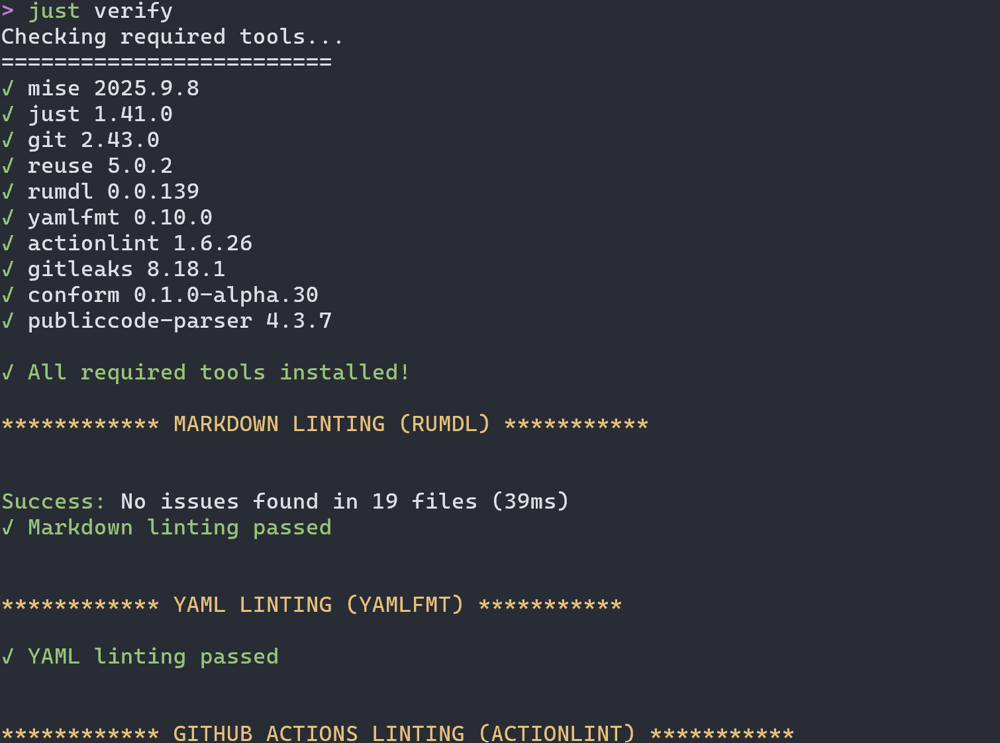

<!--
SPDX-FileCopyrightText: 2023 Digg - Agency for Digital Government

SPDX-License-Identifier: CC0-1.0
-->

# Development Guide

This guide outlines the process for submitting Pull Requests and ensuring code quality in our project.

## Pull Request Checks

When you submit a Pull Request, our Continuous Integration (CI) system will run several checks automatically.
To avoid surprises and streamline the review process, we strongly recommend running these checks locally before submitting your PR.

## Running Code Quality Checks Locally

### Prerequisites

- [Podman](https://podman.io/) must be installed on your system.

### Execution

Run the following command in your terminal:

```console
./development/code_quality.sh
```

This script will perform all necessary quality checks on your code.

## Quality Check Details

Our quality assurance process includes the following checks:

### 1. Linting

We use [megalinter](https://github.com/oxsecurity/megalinter) to perform various linting tasks:

- BASH script linting
- Markdown linting
- YAML linting
- GitHub Action linting
- Repository secret scanning (using GitLeaks and Credentials scan)

### 2. License Compliance

We use [REUSE](https://github.com/fsfe/reuse-tool) to ensure proper license compliance.
This tool checks that every file has valid copyright information in the SPDX-standard format.

### 3. Commit Structure

[Conform](https://github.com/siderolabs/conform) is used to check commit messages against our project's commit guidelines. For more details, refer to the `CONTRIBUTING.md` file.

## Interpreting Check Results

After running the quality checks, you'll receive a summary report indicating whether all checks passed or if any failed.

### Handling Failed Checks

#### Local Script Failures

1. Review the terminal output for specific error messages.
2. Fix the identified issues in your code.
3. Stage your changes (`git add`).
4. Re-run the quality check script.
5. Repeat until all checks pass.

#### CI Pipeline Failures

1. Run the code quality script locally to reproduce the CI errors.
2. Fix the issues in your local environment.
3. Update your Pull Request with the fixes.
4. The CI tests should now pass in the updated PR.

## Examples

Visual examples of the quality check outputs:

### CI Output Example


### Local Script Output Example


